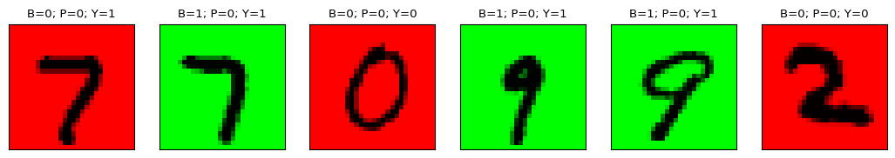

# CausalMNIST
New Benchmark for Treatment Effect Estimation with higher dimensional data

## Introduction
Describe the project here.

## Structural Causal Model
**Noises**
$$n_B \sim Be(0.5)$$
$$n_P \sim U_{[0,2]}$$
$$n_D \sim U_{[0,10]}$$
$$n_X \sim P^X$$

**Structural equations**

Step 1: Background color (1: green, 0: red)
$$B = n_B$$
Step 2: Select a digit value (0-9)
$$D = \begin{cases}
\lfloor \sqrt{10 \cdot n_D} \rfloor & \text{if } B=1 \\
\lfloor n_D \rfloor & \text{otherwise}
\end{cases}$$
Steo 3: Select a colored pen (1: white, 0: black)
$$P = \begin{cases} 
1 & \text{if } (B + \frac{D}{9} - n_P)>0 \\
0 &  \text{otherwise}
\end{cases}$$
Step 4: Draw the digit
$$X = f(B, D, P, n_X)$$
Step 5: Define outcome variable (1: high value digit, 0: low value digit)
$$Y = \begin{cases} 
1 & \text{if } D>4 \\
0 &  \text{otherwise}
\end{cases}$$

#### Example

