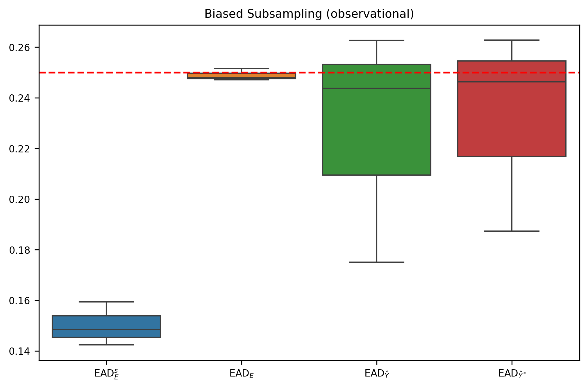

# CausalMNIST
New Benchmark for Treatment Effect Estimation with higher dimensional data

## Introduction
Describe the project here.

## Structural Causal Model
#### Noises
$$n_B \sim Be(0.5)$$

$$n_P \sim U_{[0,2]}$$

$$n_D \sim U_{[0,10]}$$

$$n_X \sim P^X$$

#### Structural equations

**Step 1:** Background color (*1: green, 0: red*)
$$B = n_B$$

**Step 2:** Select a digit value (*0-9*)
$$D = B \cdot \lfloor \sqrt{10 \cdot n_D} \rfloor + (B-1) \cdot \lfloor n_D \rfloor$$

**Step 3:** Select a colored pen (*1: white, 0: black*)
$$P = H(B + \frac{D}{9} - n_P)$$
where $H()$ is the [Heaviside step function](https://en.wikipedia.org/wiki/Heaviside_step_function)

**Step 4**: Draw the digit 
$$X = f(B, D, P, n_X)$$
i.e., draw a digit D from [MNIST](https://yann.lecun.com/exdb/mnist) and change the background and pen color.

**Step 5:** Define outcome variable (*1: high-value digit, 0: low-value digit*)
$$Y = H(D-5)$$

#### Example

## Results

### RCT: Random Subsampling

### RCT: Biased Subsampling
Describe Subsampling criteria.

